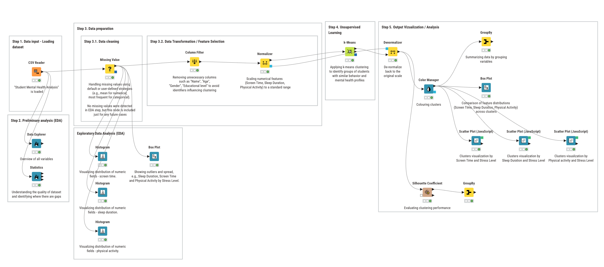
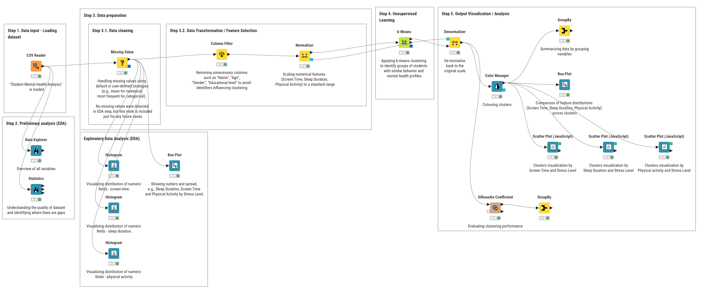

# Supervised Machine Learning for Motorcycle Selling Prices Prediction with KNIME

This project aims to apply principles and techniques of Supervised Learning (Regression analysis) to predict the selling price of used motorcycles using "Motorcycle Dataset". 

The task was approached from a typical Data Science workflow perspective, covering all the essential phases: data input, exploratory data analysis, data preparation, model training, prediction, evaluation, and final output visualization.

This project was developed using KNIME Analytics Platform, which provided a visual interface for constructing the pipeline without needing code, while still maintaining
transparency in the process and enabling reproducibility.

<a href="Supervised_DaryaMartsinouskaya.knwf">Source knwf code.</a>

# Unsupervised Machine Learning for Student Mental Health Analysis dataset with KNIME

This project presents the analysis of a behavioral dataset using unsupervised learning techniques.

The main objective is to identify distinct patterns among individuals based on their
screen time, sleep duration, physical activity, and stress levels using data from the Kaggle
dataset "Student Mental Health Analysis". Unsupervised learning, particularly clustering,
is applied to uncover hidden groupings in the data without predefined labels. The results
are further interpreted using statistical aggregation and visualizations.

The analysis follows the core phases of a data science workflow: data exploration,
preprocessing, unsupervised learning (clustering), and results interpretation using visual
tools.

The primary tool used for analysis is the KNIME Analytics Platform.

<a href="Unsupervised_DaryaMartsinouskaya.knwf">Source knwf code.</a>
